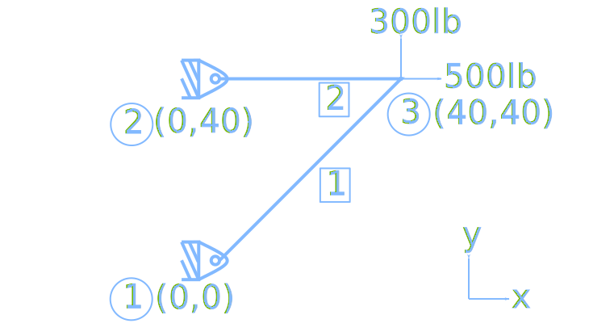

# DSMscript
A python script to compute the stress and displacement into a 2D plane truss.

## Problem

The two-element truss in Figure is subjected to external loading as shown. Using the same node and element numbering as in Figure, determine the displacement components of node 3, the reaction force components at nodes 1 and 2, and the element displacements, stresses, and forces. The elements have modulus of elasticity E1=E2=10x10^6 lb/in^2 and cross-sectional areas A1=A2=1.5 in^2.




## Output by Script
```sh
$ python truss2d.py
displacements:
 [[0.        ]
 [0.        ]
 [0.        ]
 [0.        ]
 [0.00053333]
 [0.00172941]]
stress:
 [[282.84271247]
 [133.33333333]]
```